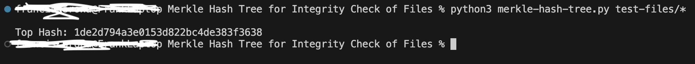

# Merkle Hash Tree for Integrity Check

## Overview
This project implements a Merkle Hash Tree using MD5 hashing to verify the integrity of multiple files. The Top Hash changes if any file is modified demonstrating data integrity.

## Output

Initial Top Hash:



Modified Top Hash after changing a file:
  


## Running the Program
To compute the Top Hash use the following command:
```bash
python3 merkle-hash-tree.py test-files/*
